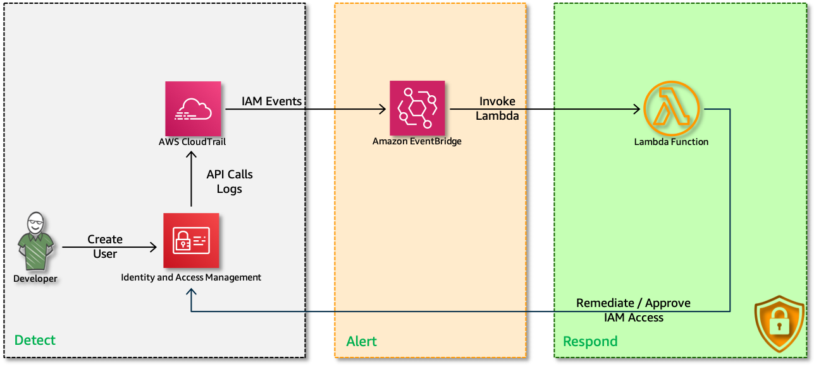

# 👮 Security Automation: Monitor, Detect and Revoke Unintended IAM Access

Is your AWS account shared across departments in your organization? Do you monitor the permissions of your users? If you have multiple accounts, used by different business entities, keeping track of IAM privileges can become a challenge as the number of users grows. For example, Can you answer these questions definitively?

- Do you who can  `create new user` in your AWS Account[s]?
- Do you monitor `create new user` IAM events?
- Do you monitor `modify user/group` IAM events?
- Do you have mechanisms to `revoke privileges` in case of a security incident?

That is exactly what we are going to do right now using, `AWS IAM`, `AWS CloudWatch`, `AWS StepFunctions` & `SNS`

  

  Follow this article in **[Udemy][101]**

1. ## 🧰 Prerequisites

    This demo, instructions, scripts and cloudformation template is designed to be run in `us-east-1`. With few modifications you can try it out in other regions as well(_Not covered here_).

    - AWS CLI pre-configured - [Get help here](https://youtu.be/TPyyfmQte0U)
    - **Optional** AWS CDK Installed & Configured - [Get help here](https://www.youtube.com/watch?v=MKwxpszw0Rc)

1. ## 🎯 Solution Overview

    In this repo, I have included a cloudformation template that provisions the resources to set-up a fully automatic IAM remedation engine.

    - **DENY-IAM-Policy**: A customer managed policy that denies iam permissions.
        - Deny policy takes precedence over other policies<sup>[1][1]</sup>
    - **Lambda**:
        - *EXTREME REMEDIATION ACTION*: Quarantines the IAM user with `DENY-IAM` policy
            - As this is a demo, This automation will revoke IAM privileges for the user with the deny iam policy. You can modify this lambda to suit your needs
            - Will quarantine user ONLY when user is **NOT** part of `admins` group
    - **EventBridge Rule**: Triggers the Lambda function
        - The event will trigger ONLY when the IAM event is triggered by an IAM User
    - **CloudTrail**: To monitor all IAM API Events
    - **IAM Roles**: For lambda and step functions with restrictive permissions

    _**Note**: Sample commands to trigger ssh failures to test the solution can be found in the output section of the cloudformation template_

1. ## 🚀 Deployment

  You have couple of options to set this up in your account, You can use [AWS CDK](https://www.youtube.com/watch?v=MKwxpszw0Rc) or use the cloudformation template generated by CDK. All the necessary steps are baked into the templates, you can launch it and try it out.

1. ### Method 1: Using AWS CDK

      If you have AWS CDK installed you can close this repository and deploy the stack with,

        ```sh
        # If you DO NOT have cdk installed
        npm install -g aws-cdk

        git clone https://github.com/miztiik/security-automation-remediate-unintended-iam-access.git
        cd security-automation-remediate-unintended-iam-access
        source .env/bin/activate
        pip install -r requirements.txt
        ```

      The very first time you deploy an AWS CDK app into an environment _(account/region)_, you will need to install a `bootstrap stack`, Otherwise just go ahead and deploy using `cdk deploy`

        ```sh
        cdk bootstrap
        cdk deploy
        ```

1. ### Method 2: Using AWS CloudFormation

      Look for the cloudformation template here: `cdk.out` directory, _From the CLI,_

        ```sh
        aws cloudformation deploy \
            --template-file ./cdk.out/security-automation-remediate-unintended-iam-access.template.json \
            --stack-name "MiztiikAutomationStack" \
            --capabilities CAPABILITY_IAM
        ```

1. ## 🔬 Testing the solution

    1. Create IAM Admin Group(for example `admins`), if you do not have one.
    1. Goto Lambda Console>Update the `Environment` variable `ADMIN_GROUP_NAME` to your admin group name
        - The default is set to `admins`. **Warning** You will deny iam privileges to any user triggering this automation who is not part of this group.
    1. Create IAM User(for example `baduser`), with `IAM Access` but _NOT_ part of `admins` group.
    1. Try to create a new user or modify an user(_sample commands in cloudformation outputs_)
    1. Wait for  minute and check if the user(`baduser`) has a new `DENY-IAM` policy attached.
        - You can also check the lambda execution logs for more details

    Now that we have confirmed the solution is working, you can extend the solution as required. From now on, whenever a user who was given unintended access to IAM APIs makes an API call against IAM, this automation will detect those events and revoke the user's IAM access.

    **NOTE:** The new IAM policy might not take effect for a few minutes after you create it, because of eventual consistency. Therefore, it is possible that a user will continue to be able to make successive calls to IAM for a short time after the first detection.

1. ## Next Steps: Do Try This

    - Break down the lambda into a step function
    - Add more remediation actions,
        - Notify InfoSecOps
        - Reverse actions carried out by user.

1. ## Additional Comments

    As mentioned earlier, this is a reactive solution. This automation should not be the primary means of defence against weak policies. You should consider,

    - Who has permissions to create, modify user permissions?
    - Are you auditing those privileges automatically?
    - If all else fails, do you have mechanisms that will automatically respond to events?

1. ## 🧹 CleanUp

    If you want to destroy all the resources created by the stack, Execute the below command to delete the stack, or _you can delete the stack from console as well_

    1. Delete (any)Quarantine Deny Policy
    1. Delete (any)user/groups created - as required
    1. Delete the stack[s],

    ```bash
    # Delete the CF Stack
    aws cloudformation delete-stack \
        --stack-name "MiztiikAutomationStack" \
        --region "${AWS_REGION}"
    ```

    This is not an exhaustive list, please carry out other necessary steps as maybe applicable to your needs.

### 📚 References

1. [IAM Policy Evaluation Logic][1]
1. [Detect Unintended IAM Access][2]

## 📌 Who is using this

This Udemy [course][101] uses this repository extensively to teach advanced AWS Cloud Security to new developers, Solution Architects & Ops Engineers in AWS.

### 💡 Help/Suggestions or 🐛 Bugs

Thank you for your interest in contributing to our project. Whether it's a bug report, new feature, correction, or additional documentation or solutions, we greatly value feedback and contributions from our community. [Start here][200]

### 👋 Buy me a coffee

Buy me a [coffee ☕][900].

### 🏷️ Metadata

**Level**: 200

[1]: https://docs.aws.amazon.com/IAM/latest/UserGuide/reference_policies_evaluation-logic.html

[2]: https://aws.amazon.com/blogs/security/how-to-monitor-and-visualize-failed-ssh-access-attempts-to-amazon-ec2-linux-instances/

[100]: https://www.udemy.com/course/aws-cloud-security/?referralCode=B7F1B6C78B45ADAF77A9

[101]: https://www.udemy.com/course/aws-cloud-security-proactive-way/?referralCode=71DC542AD4481309A441

[102]: https://www.udemy.com/course/aws-cloud-development-kit-from-beginner-to-professional/?referralCode=E15D7FB64E417C547579

[103]: https://www.udemy.com/course/aws-cloudformation-basics?referralCode=93AD3B1530BC871093D6

[200]: https://github.com/miztiik/security-automation-remediate-unintended-iam-access/issues

[899]: https://www.udemy.com/user/n-kumar/

[900]: https://ko-fi.com/miztiik
